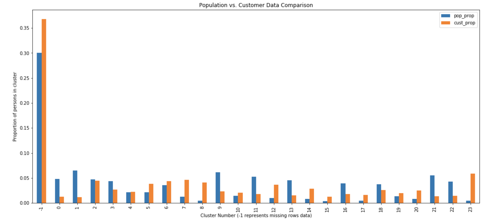

# Identify Customer Segments with Arvato

## Overview
In this project, Bertelsmann partners AZ Direct and Arvato Financial Solutions have provided two datasets one with demographic information about the people of Germany, and one with that same information for customers of a mail-order sales company. I have looked at relationships between demographics features, organized the population into clusters, and saw how prevalent customers are in each of the segments obtained.

This project was completed as part of Udacity's [Data Scientist Nanodegree](https://eu.udacity.com/course/data-scientist-nanodegree--nd025) certification.

## Objectives
Apply unsupervised learning techniques on demographic and spending data for a sample of German households. Preprocess the data, apply dimensionality reduction techniques, and implement clustering algorithms to segment customers with the goal of optimizing customer outreach for a mail order company.

## Data Origin
The files used in the project:

- `Udacity_AZDIAS_Subset.csv` : Demographic data for the general population of Germany; 891211 persons (rows) x 85 features (columns).
- `Udacity_CUSTOMERS_Subset.csv` : Demographic data for customers of a mail-order company; 191652 persons (rows) x 85 features (columns).
- `Data_Dictionary.md` : Information file about the features in the provided datasets.
- `AZDIAS_Feature_Summary.csv` : Summary of feature attributes for demographic data.
- `Identify_Customer_Segments.ipynb` : Jupyter Notebook divided into sections and guidelines for completing the project. The notebook provides more details and tips than the outline given here.

## Tools, Software, techniques and Libraries
This project uses the following software and Python libraries:
- Python 3.6
- numpy, pandas, sklearn
- matplotlib, seaborn
- PCA, k-means clustering
- Jupyter Notebook

## Results
A comparison of customer to demographics data. The two clusters distribution comparison allowed to see where the strongest customer base for the company is.

The company seems to be doing well with rather older people, living in less-dense households, more traditional and conservative (focus on investing/saving) where mail order sales can appear to be a more attractive option.

The company is not so efficient in targeting more younger and educated audience, living in more high-density areas, having bigger consumption and being more materialistic (focus on spending). This group of people may be rather using on-line purchases today but with a proper marketing... who knows?

## Details
- [HTML Preview](https://ksatola.github.io/projects/Identify_Customer_Segments10new_final.html)
- [Jupyter Notebook](https://github.com/ksatola/Identify-Customer-Segments-with-Arvato/blob/master/Identify_Customer_Segments10new_final.ipynb)
